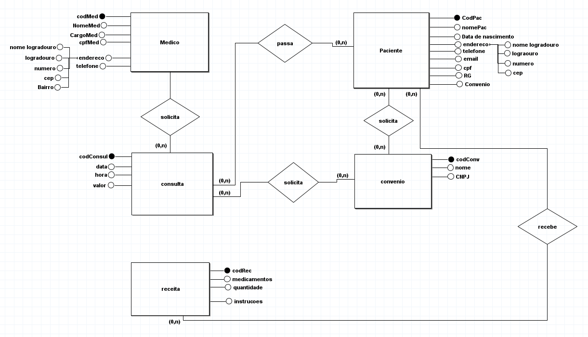
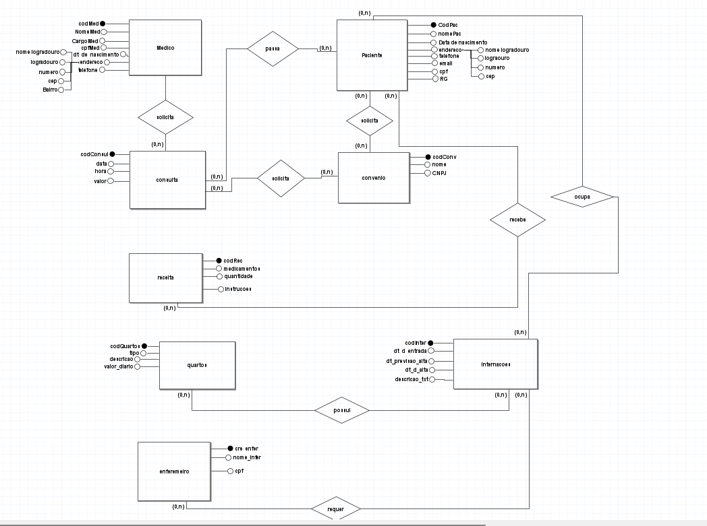

 <h1>Atividades de banco de dados Proa</h1>

<h2> 1: O Hospital Fundamental</h2>

         <h3>Uma história para começar</h3>  
     Um pequeno hospital local busca desenvolver um novo sistema que atenda melhor às suas necessidades. Atualmente, parte da operação ainda se apoia em planilhas e          arquivos antigos, mas espera-se que esses dados sejam transferidos para o novo sistema assim que ele estiver funcional. Neste momento, é necessário analisar com          cuidado as necessidades desse cliente e sugerir uma estrutura de banco de dados adequada por meio de um Diagrama Entidade-Relacionamento.  

       <h3>Maos a obra</h3>  
       Analise a seguinte descrição e extraia dela os requisitos para o banco de dados:
       O hospital necessita de um sistema para sua área clínica que ajude a controlar consultas realizadas. Os médicos podem ser generalistas, especialistas ou        residentes e têm seus dados pessoais cadastrados em planilhas digitais. Cada médico pode ter uma ou mais especialidades, que podem ser pediatria, clínica geral, gastroenterologia e dermatologia. Alguns registros antigos ainda estão em formulário de papel, mas será necessário incluir esses dados no novo sistema.   
       Os pacientes também precisam de cadastro, contendo dados pessoais (nome, data de nascimento, endereço, telefone e e-mail), documentos (CPF e RG) e convênio. Para cada convênio, são registrados nome, CNPJ e tempo de carência.

As consultas também têm sido registradas em planilhas, com data e hora de realização, médico responsável, paciente, valor da consulta ou nome do convênio, com o número da carteira. Também é necessário indicar na consulta qual a especialidade buscada pelo paciente.

Deseja-se ainda informatizar a receita do médico, de maneira que, no encerramento da consulta, ele possa registrar os medicamentos receitados, a quantidade e as instruções de uso. A partir disso, espera-se que o sistema imprima um relatório da receita ao paciente ou permita sua visualização via internet.

<h3>Solução:</h3>

                                               

                                               
 <h2>2: Os Segredos do Hospital</h2>
 
 <h4>E não era exatamente aquilo! </h4>
 
 

     Após a primeira versão do projeto de banco de dados para o sistema hospitalar, notou-se a necessidade de expansão das funcionalidades, incluindo alguns requisitos essenciais a essa versão do software. As funcionalidades em questão são para o controle na internação de pacientes. Será necessário expandir o Modelo ER desenvolvido e montar o banco de dados, criando as tabelas para o início dos testes.

Entender do assuntoConsidere a seguinte descrição e o diagrama ER abaixo:
No hospital, as internações têm sido registradas por meio de formulários eletrônicos que gravam os dados em arquivos. 
Para cada internação, são anotadas a data de entrada, a data prevista de alta e a data efetiva de alta, além da descrição textual dos procedimentos a serem realizados. 
As internações precisam ser vinculadas a quartos, com a numeração e o tipo. 
Cada tipo de quarto tem sua descrição e o seu valor diário (a princípio, o hospital trabalha com apartamentos, quartos duplos e enfermaria).
Também é necessário controlar quais profissionais de enfermaria estarão responsáveis por acompanhar o paciente durante sua internação. Para cada enfermeiro(a), é necessário nome, CPF e registro no conselho de enfermagem (CRE).
A internação, obviamente, é vinculada a um paciente – que pode se internar mais de uma vez no hospital – e a um único médico responsável.

   Mãos a obra?
Faça a ligação do diagrama acima ao diagrama desenvolvido na atividade antrior, construindo relacionamentos com entidades relacionadas. E eleve o seu diagrama para que já selecionando os tipos de dados que serão trabalhados e em quais situações. 
Por último, crie um script SQL para a geração do banco de dados e para instruções de montagem de cada uma das entidades/tabelas presentes no diagrama completo (considerando as entidades do diagrama da atividade anterior e as novas entidades propostas no diagrama acima). Também crie tabelas para relacionamentos quando necessário. Aplique colunas e chaves primárias e estrangeiras.
Use ferramentas, como ERPlus, Lucidchart, draw.io (via web) e MySQL Workbench, ou mesmo um editor de imagens para o diagrama.  Você pode utilizar o MySQL Workbench ou o DBdiagram.io para montar os scripts SQL.
Importante: desse modelo já vamos para a etapa lógica da nossa modelagem!

 

<a href="https://github.com/GuiDEV1/Banco_de_dados_Mer_Proa/blob/main/scripts/Hospital.sql">Ver modelo fisico / script</a>

 

 
   <h2>3: O Prisioneiro dos Dados </h2
   
   <h4>De que serve o banco sem dados?</h4> 
   Então vamos alimentar o banco!    
   
   
   

       Com o banco de dados para o sistema hospitalar completamente montado, é necessário incluir dados para realizar os devidos testes e validar sua viabilidade              quanto ao sistema. Nesta etapa, também é importante realizar a separação de alguns scripts iniciais para o banco, com os dados que serão necessários a um              povoamento inicial do sistema.
   

   
   
   
   

       <h3>Jogando nas regras que você criou:</h3> 
       Crie scripts de povoamento das tabelas desenvolvidas na atividade anterior
       Observe as seguintes atividades: 
   

   
   <ul>
       <li>Inclua ao menos dez médicos de </li>
       <li>Ao menos sete especialidades (considere a afirmação de que “entre as   especialidades há pediatria, clínica geral, gastroenterologia e dermatologia”)            </li>
       <li>Inclua ao menos 15 pacientes.</li>
       <li>
             Registre 20 consultas de diferentes pacientes e diferentes médicos (alguns pacientes realizam mais que uma consulta). As consultas devem ter ocorrido                  entre 01/01/2015 e 01/01/2022. Ao menos dez consultas devem ter receituário com dois ou mais medicamentos.
       </li>
       <li>Inclua ao menos quatro convênios médicos, associe ao menos cinco pacientes e cinco consultas.</li>
       <li>Criar entidade de relacionamento entre médico e especialidade. </li>
       <li>Criar Entidade de Relacionamento entre internação e enfermeiro. </li>
       <li>Arrumar a chave estrangeira do relacionamento entre convênio e médico.</li>
       <li>Criar entidade entre internação e enfermeiro.</li>
       <li>Colocar chaves estrangeira dentro da internação (Chaves Médico e Paciente).</li>
       <li>
           Registre ao menos sete internações. Pelo menos dois pacientes devem ter se internado mais de uma vez. Ao menos três quartos devem ser cadastrados. As                  internações devem ter ocorrido entre 01/01/2015 e 01/01/2022.
       <li>
       <li>
           Considerando que “a princípio o hospital trabalha com apartamentos, quartos duplos e enfermaria”, inclua ao menos esses três tipos com valores diferentes.
       <li>
       <liInclua dados de dez profissionais de enfermaria. Associe cada internação a ao menos dois enfermeiros.<li>
       <li>
           Os dados de tipo de quarto, convênio e especialidade são essenciais para a operação do sistema e, portanto, devem ser povoados 
           assim que o sistema for instalado.             
       </li>
   </ul>
   
   
   <a href = 'https://github.com/GuiDEV1/Banco_de_dados_Mer_Proa/blob/main/scripts/hospitalScript2.sql'>Ver modelo fisico / script 2</a>
   
   

   
   <h2>A Ordem do Alterar. </h2>
   
   
   

        Hummm... 
       Não... Não acabou... 
       Um banco de dados pode sofrer alterações ao longo da sua concepção e do seu desenvolvimento. Nesse momento devemos nos preparar para atualizar nossas                  estratégias. 
   

   
   
   <h3>Mãos a Obra</h3>
   
   

      Pensando no banco que já foi criado para o Projeto do Hospital, realize algumas alterações nas tabelas e nos dados usando comandos de atualização e exclusão:
      Crie um script que adicione uma coluna “em_atividade” para os médicos, indicando se ele ainda está atuando no hospital ou não. 
      Crie um script para atualizar ao menos dois médicos como inativos e os demais em atividade.
   

   
   <a href = 'https://github.com/GuiDEV1/Banco_de_dados_Mer_Proa/blob/main/scripts/hospital3.sql'>Ver modelo fisico / script 3</a>
 
 
